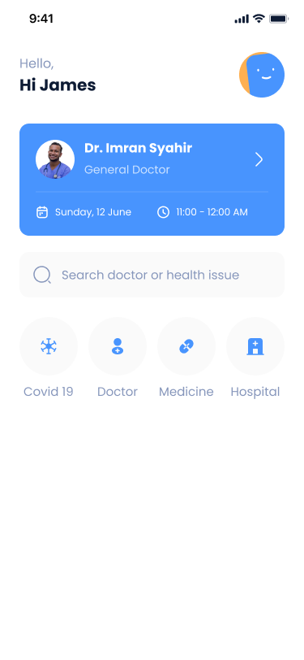
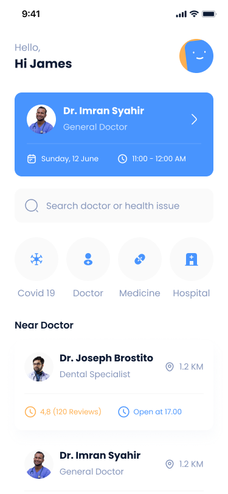
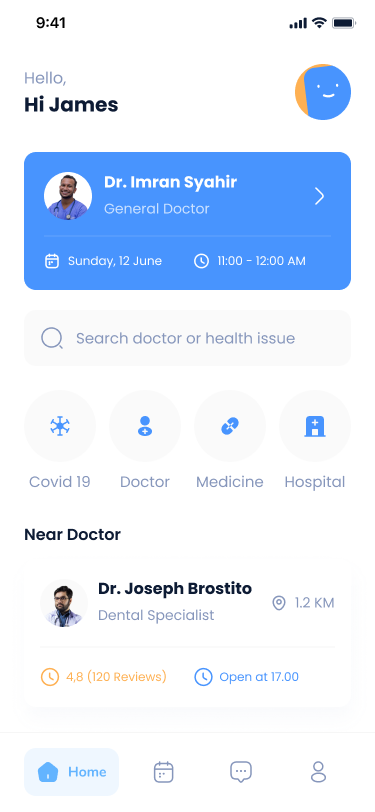

# «Профессиональная разработка мобильных приложений»

## Лабораторная работа №2: реализация экрана при помощи SwiftUI (IOS-разработка)

## Моя ужасная история

Сказать, что лаба далась легко - обмануть всех на свете. Самое интересное, что сложным была отнюдь не верстка, а возня с MacOS...

Я пробовал установить виртуалку, она не хотела работать адекватно, даже с 12 ГБ и 4-мя ядрами, которые ей были выделены. Но вовремя у друга сломался ноутбук, и он купил старенький мак, и это было спасение...

Но даже с маком на руках было не все так просто. Не знаю, почему, у меня не работала система контроля версий в XCode, это не считая, что я перепробовал множество версий программы, потому что вечно ловил бесконечную загрузку симулятора, компиляцию проекта и прочие технические шоколадки... Потому большую часть времени пришлось писать вслепую.

Гит так и не заработал, зато появилось превью вместе с симулятором на версии **XCode 14.1** (**Mac OS 12.7.1**). И появилась надежда закончить лабу. Я заархивирвоал результат, перекинул на свой компьютер и в VSCode загрузил все на гит. 

Потому уверенности, что при клонировании репозитория код запустится, нет...... Но есть надежда, что все адекватно перенеслось :)

Вот, такая вышла лаба, это было серьезное испытания для нервов, но мы его прошли!

## Задание

Реализуйте представленный ниже экран используя SwiftUI.

- Экран состоит из 5 состояний, начните с первого состояния и дополняйте верстку до финального состояния.
- Данные храните локально, экран должен работать без подключения к интернету.
- Результат работы залейте на созданный вами GitHub репозиторий.
- Заполните Readme в вашем проекте и приложите скриншоты реализованного экрана и apk файл.
- Убедитесь, что ваш проект может быть запущен на другом компьютере.

    
    
    
    
    

## Описание приложения

Глобально, экран состоит из следующих частей:

1. приветственный заголовок;
2. информация о ближайшем враче;
3. поле с поиском;
4. категориальное меню;
5. блок с ближайшими врачами;
6. нижняя навигационная панель.

## Результат работы

В результате работы был **реализован экран**, состоящий из всех компонентов. Также был **создан репозиторий**, 
в котором хранится история версий экрана (присутствует **ветвление**). Был **оформлен файл README.md**, 
хранящий информацию о лабораторной работе, **приложены скриншоты работы**. **Настроен .gitignore**, 
чтобы в проекте не было лишних файлов.
